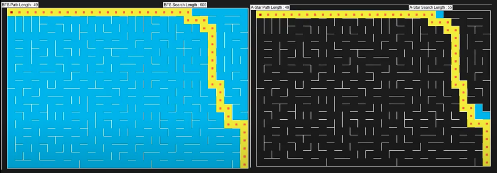
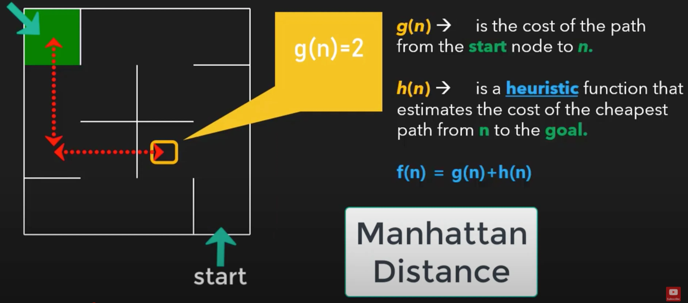
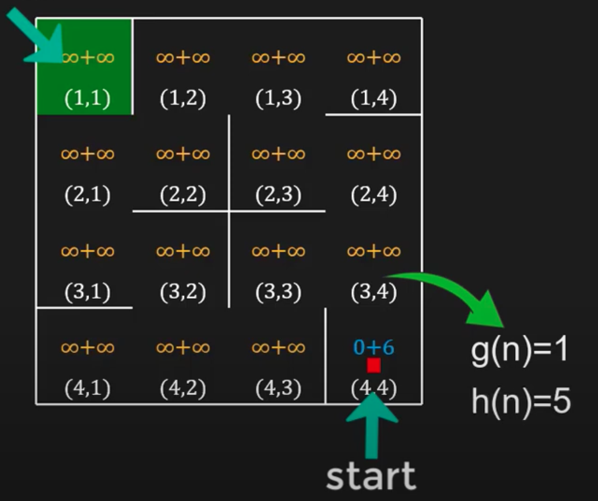
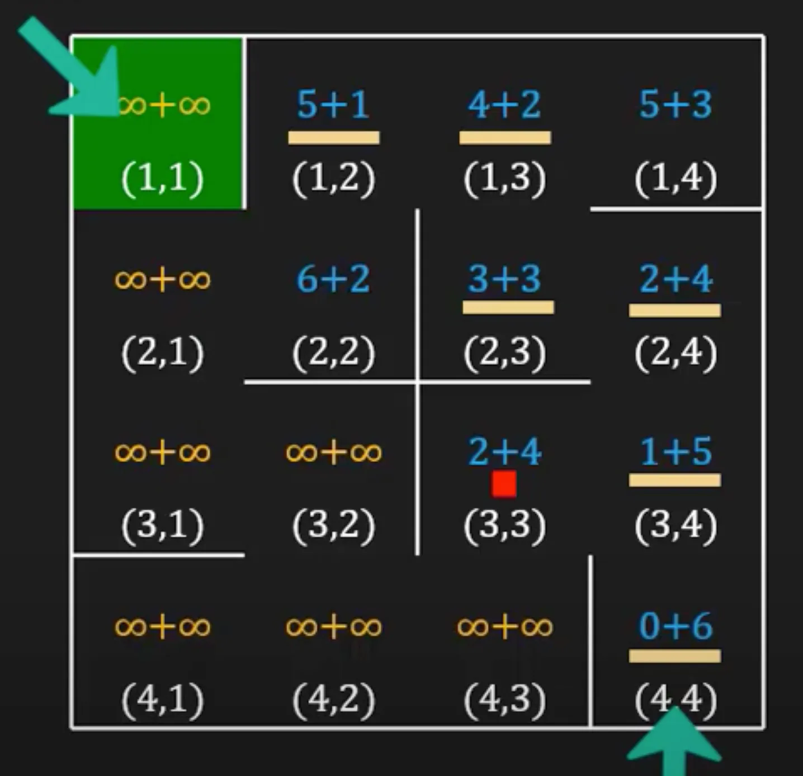
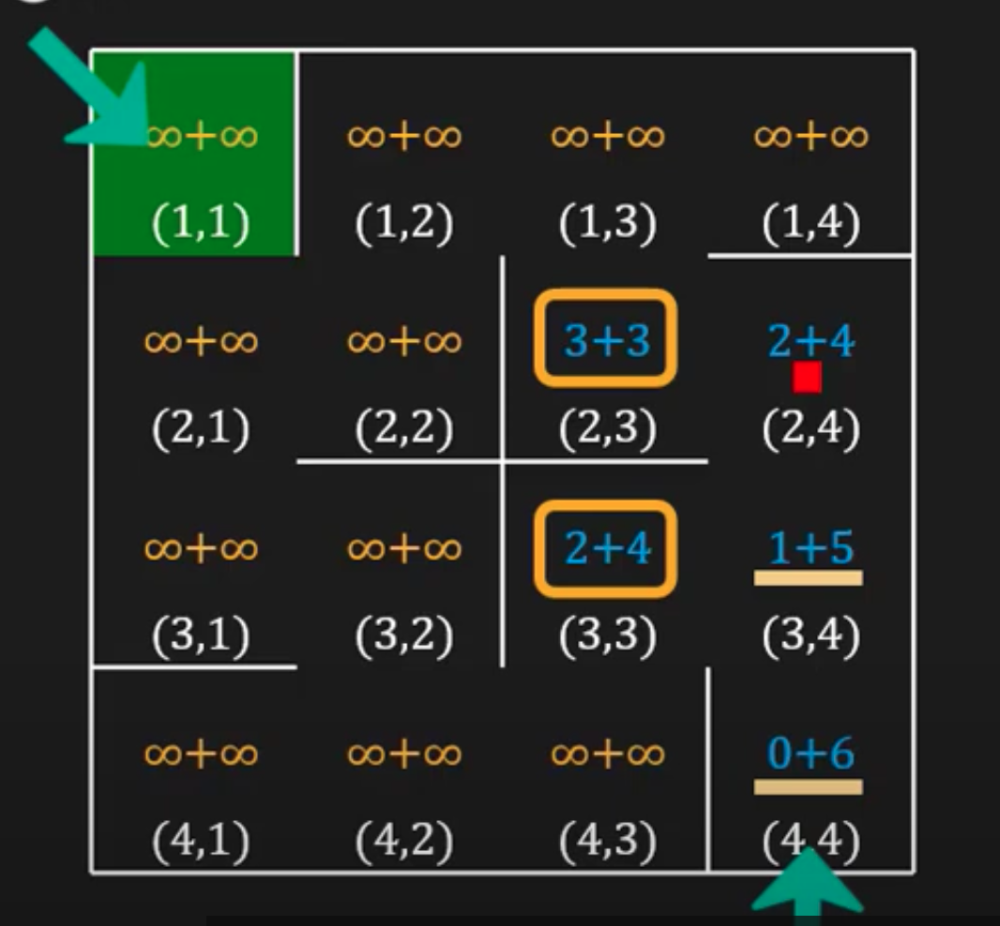

# A* Search

This gives the optimal solution for searching, in general meaning shortest path.

Why do A* over BFS if BFS finds shortest path?

- A* searches significantly less cells
- BFS (600 cells searched) v.s A* 55 cells searched
    

    
It is an informed search algorithm, meaning it takes in the location of the goal while deciding the next move (as opposed to just seeing what are the available options are.

Concept:

- there’s a cost associated with each cell of the maze and a* will try to minimize the price

$$
f(n) = g(n)+h(n)
$$

- where f(n) is the cost of a node/cell and it has two components: g(n) and h(n)
    - g(n) is the cost of the path from start node to n (# of steps to reach to cell n from the start cell)
    - h(n) is the heuristic function that estimates the cost of the cheapest path from n to the goal
        
        

        
- in the above, g(n) is 2 because we took 2 steps to get there
- for h(n), we do an approximate
    - Euclidean: finds the “shortest” path, but we can’t travel diagonally in a maze, so we’re using Manhattan distance
    - h(n) = 4

So:

- starts at (m.rows, m.cols), where g(n) = 0 and h(n) = 6 (which is the Manhattans distance to 1,1) and f(n) starts at infinity
- check possibilities
    
    
    
    - in the above, we moved one, those g(n) +=1 and the manhattans distance is now 5. We are now at (3,4)
- Next, look at its neighbours (2,4), (4,4) and (3,3)
    - (4,4)→ g(n) = 2 nd h(n) = 6 so f(n) = 8
        - since prev cost is smaller, we rule this out meaning we don’t update its cost
    - (3,3) → g(n) = 2 and h(n)  = 4 so f(n) = 6
    - (2,4) → g(n) = 2 and h(n) = 4 so f(n) = 6
    - we decide the next cell based on present minimum cost
        - only the cell which are not visited yet or their cost has been updated will be considered
    - with a tie, we can just choose one at random (?), say we choose (2,4), the possibilities are (2,3) and(3,4)
        - (2,3)→ g(n)=3, h(n) = 3 and f(n) = 6
        - (3,4) → g(n) = 3, h(n) = 5 and f(n) = 8
- Then, we compare the minimum costs. from last rotation, we had (3,3) stored with f(n) = 6, and now we have (2,3) which also has f(n) = 6. However, (2,3) has a lower heuristic cost so we will choose (2,3)
    
    
    
- We’re at (2,3) now and our options are (2,4) → f(n) = 8 and (1,3)→ f(n) = 6 so we’ll update the cost at (1,3)
    - compare back to (3,3) since they both have same f(n), but again because of lower heuristic score we choose (1,3)
- We’re at (1,3) now —> we compare (1,2), (1,4), (2,3) and we get that (1,2) has lowest score of 6. We compare this with (3,3) again and choose (1,2)
- We’re at (1,2) now —> f(n) = 6 and look at the possibilities (2,2) and (1,3). We choose (2,2), which has a score of f(n) = 8
    - This is larger than the minimum cost at (3,3), so we will move to 3,3) instead
        
    

        
- We’re at (3,3) now and see the possibilities: which is (4,3) and f(n) = 8
    - Now, we compare (2,2) and (4,3) since both f(n) = 8. We will choose (2,2) since it has the lower heuristic score
- We’re at (2,2) now, we we go to (2,1)
- We’re at (2,1) and we go to (1,1) → f(n) = 8 since the other options (1,2), (3,1) both have f(n) of 10 and we’re reached the target!

## DS: Priority Queue

- uses FIFO (first in, first out principle), HOWEVER…
- in priority queue, stored items come out on the bases of priority and not on the basis of the order of their entry,  so the item with the highest priority will come out FIRST
- what is priority? it can be the value of an item (i.e higher value = higher priority, lower value = higher priority)
    - we can use python’s priority queue module from the queue library, where the lowest value of the item inside the priority queue
- in a*, we must pick the cell with the lowest cost so priority queue is the most suitable DS

## Pseudocode

- define a priority queue: open
- two hashmaps:
    - g_score: {cell: infiinity → for all cells and 0 for start cell}
    - f_score: {cell: infinity→ for all cells and h(start) for start cell}
        - h(start) is the heuristic function’s value (for instance, the Manhattan’s) distance
        - f(n) = g(n) + h(n) and since g(n) is 0 at the start, f(n) = h(n)
- first entry inside the queue consists of 3 values of the start cell: f(n) of start cell, h(n) of start cell and start
    - these three values will be represented as a tuple in that order
    - in the case that the first value is the same (f(n)), the tie breaker is decided by the next (h(n))
    - third element is the cell value itself
- while open is not empty or the goal is reached:
    
    # queue will only be empty if there is NO path reachable
    
    - currCell→ open.get cell value
    - for each direction(ESNW):
        - childCell = next possible cell
        - tempg_score = g_score(currCell) +1
        - tempf_score = tempg_score + h(childCell)
    - if tempf_score < f_score(childCell):
        - g_score(childCell) = tempg_score
        - f_score(childCell) = tempf_score
        - open.put(f_score(childCell),h(childCell),childCell) # puts it into the priority queue as a tuple
