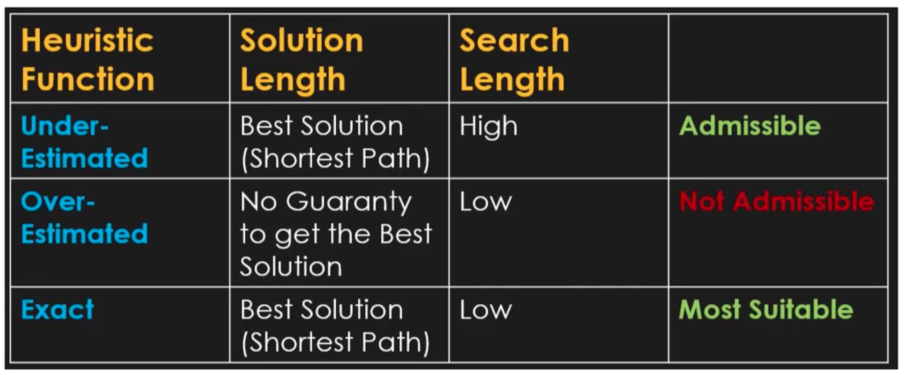

# Search Comparison: A* | DFS | BFS

Based on metrics

- length of final path from start to goal
- length of the search path (search space)
- time consumption/complexity

### Comparisons

1. BFS v.s DFS
    1. In general, DFS is more memory efficient
    2. Overall:
        1. when we have a perfect maze/tree, DFS outperforms bfs GENERALLY
        2. for multiple path graphs, we typically choose BFS since it guarantees shortest path
2. BFS vs A*
    1. A* is generally more efficient, in the tests A* was the better option in all 3 metrics
    2. However, BFS is used much more widely since A* requires a heuristic function (which can severely impact the results)
        1. also, BFS implementation is just simpler
3. Heuristic function comparisons in A*
    1. Manhattan
        1. this is the ideal heuristic function in this case since Euclidean underestimates the distance (given how you can’t travel diagonally in a maze)
            1. if you overestimate it (for instance, discarding sqrt in euclidean) then it might not give you the shortest path
    2. Euclidean
    3. The optimal path is usually the least # of cells searched to the target
        
        

