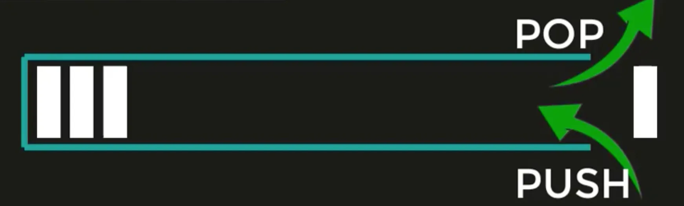
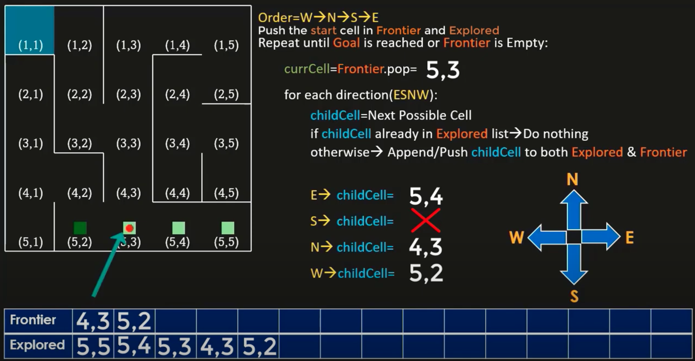

# Depth First Search (DFS)

## Context

- Start at the root note (Node 1)
    - start at leftmost child (check if its your target)
        - if not, go to its leftmost child and keep exploring until it reaches the leaves
            - if not found, go back to a higher level and search the remaining nodes
    - Priority for nodes: left, center, right
        - it not, then goes back to the previous node
        - **in the context of the maze, we use directions in the order of priority: west, north south, east** (again, prioritizing left first)

Playing out in the maze:

- Starts at the bottom right (starting point)
- Checks priority
    - moves west if it can, (if not, then north, south, east)
- Marks where there is a split in the path (continue following the priority until it can no longer)
    - then, it goes back to where the split was

## DS: Stack

- using a Stack: data structure used for the collection of objects and is based on the principle of LIFO (last in, first out)
    - items are pushed into the stack, and when we want to access it we pop the most recently pushed item (think of it like a tube closed on one side)
        
        
        
        
    - there’s no built in stack in Python, but we use a list easily since we can add, remove and change items inside of a list at any location
        - append() to push (adds element at the end of the list)
        - pop() to return element at the highest index of the list (pops)

## Pseudocode

- initialize a stack called **Frontier** (cells to explore)
- initialize a list called **Explored** (cells already searched)

1. Define the order of priority
    - W → N → S → E
2. Pushes the start cell in Frontier and  Explored list
3. Then, repeat below until Goal is reached or Frontier is empty

```python
currCell = Frontier.pop

for reach direction(ESNW): 
# we consider all four directions in this order
# notice it is in reverse of the priority order we defined above
# this is because of the LIFO nature of a stack
	childCell = Next Possible Cell
	if childCell already in Explored list --> don't do anything
	else  -> append/push childCell to both Explored and Frontier
```



