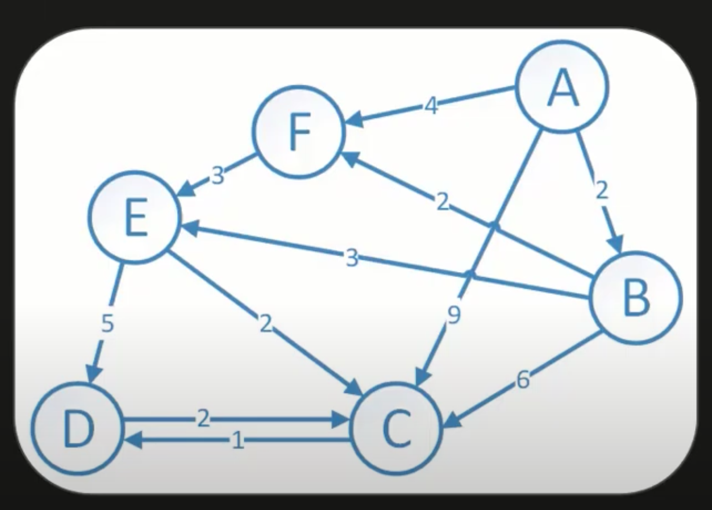

# Dijkstra’s Algorithm

- algorithm for finding the shortest path between nodes in a weighted graph
    - for instance: on Google Maps, you’ll see that it doesn’t necessarily choose the path ONLY based on distance, but rather it takes into account other factors such as traffic/weather (these are similar to edges that have a “weight” associated with it)
- uses the OSPF (Open Shortest Path First) algorithm to decide path

## Dijkstra Algorithm on a Weighted Graph:

All costs are positive cost or weights as Dijkstra algorithm may give inaccurate answers for negative weight graphs (for negative weight graphs, we use Bellman Ford Algorithm)

For the working principle of the Dijkstra algorithm, we use a greedy algorithm

- Starts from the first node (A) and will store all directed nodes (B,F,C) and chooses the minimum cost there (B)
- From (B), it’ll check (C,F)
    - The path from A→ is 9 and path from A→B→C is 8, so we’ll keep going here
    - In essence, the algorithm will keep selecting the next node with the minimum cost (here is the greedy implementation >:)) and see if a better cost path is available

Table below will depict the distance to travel from A→All Point

| Step | A | B | C | D | E | F | Notes |
|------|---|---|---|---|---|---|-------|
|      | 0 | ∞ | ∞ | ∞ | ∞ | ∞ | Starting Node at A |
| A-0  | 0 | 2 | 9 | ∞ | ∞ | 4 | Mark A as a visited Node, then by greedy principle we choose B. We’ll update the cost if we get a better cost from node B (but the update is only possible for the unvisited nodes because the visited nodes are already at their minimum since all costs are positive). This means that after we look at A, we can only look at B, C, D, E, F, and so on. |
| B-2  | 0 | 2 | 8 | ∞ | 5 | 4 | We updated C since the distance from A→B→C is 8 whereas A→C is 9. We updated E since A→B→E is 5 whereas previously it was infinity. We visited A, B so far, so we can only look at C, D, E, F. We take F as the next reference (by greedy principle). |
| F-4  | 0 | 2 | 8 | ∞ | 5 | 4 | There’s only one node (E) connected to F. F→E = 3 so A→F→E = 7. This is higher than the previous route of 5, so we keep it at 5. F is not directly connected with any other nodes, so all other values remain unchanged. We visited A, B, F so far, so we can only look at C, D, E. We take E as the next reference. |
| E-5  | 0 | 2 | 7 | 10| 5 | 4 | We updated C, since the cost from A→B→E→C is 7 whereas previously it was 8. We updated D, since the cost of A→B→E→D is 10, previously it was infinity. All values remain unchanged. We visited A, B, F, E so far, so we can only look at C, D. We choose C as the next reference (greedy). |
| C-7  | 0 | 2 | 7 | 8 | 5 | 4 | We update D, since A→B→E→C→D is 8, previously it was 10. We visit D (last node). |
| D-8  | 0 | 2 | 7 | 8 | 5 | 4 | No unvisited nodes remain, hence it will remain the same. Solved! :) |
